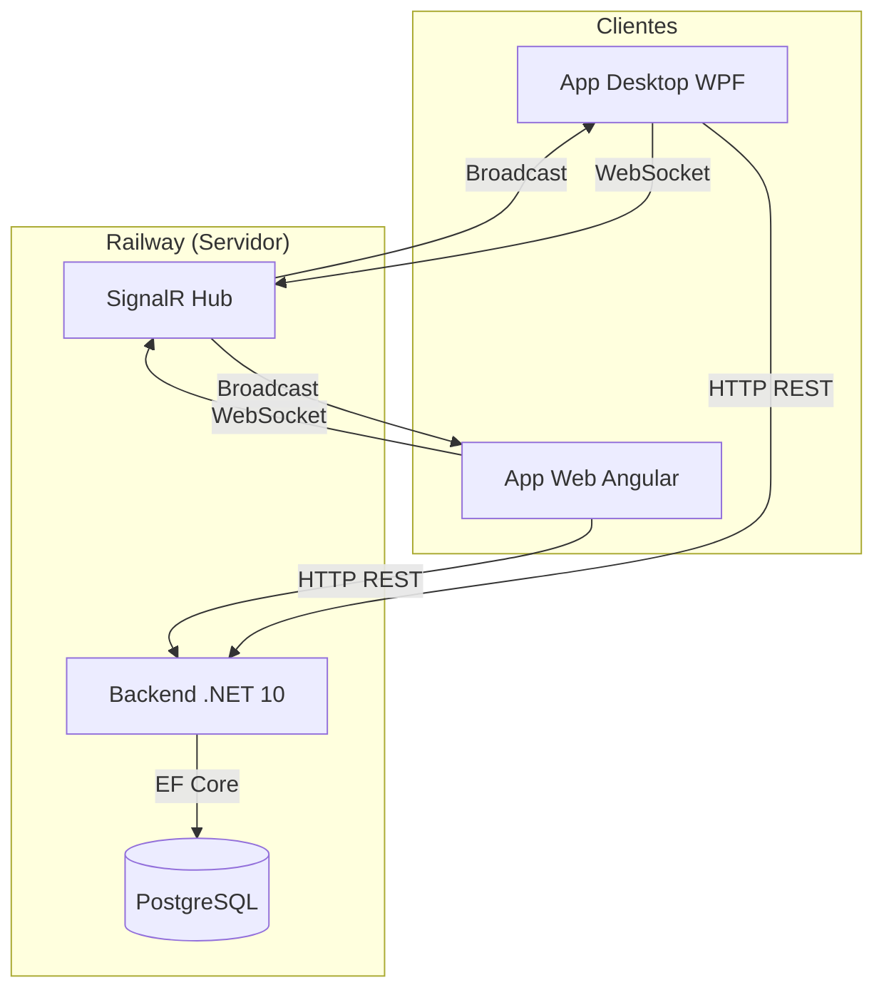
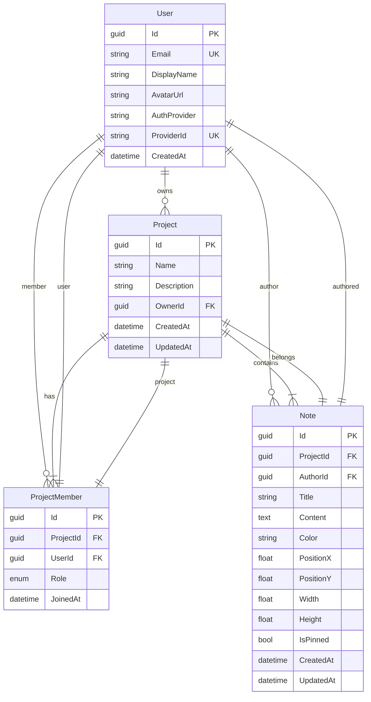
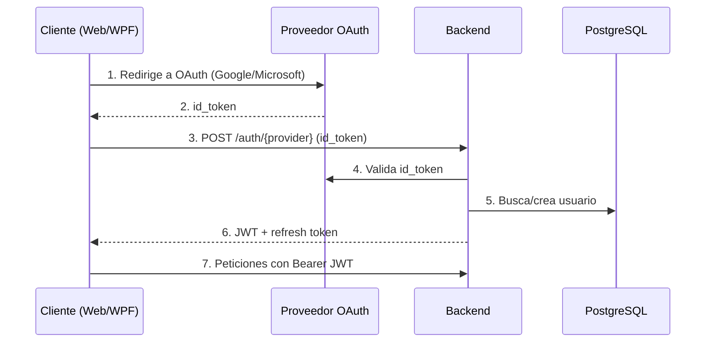
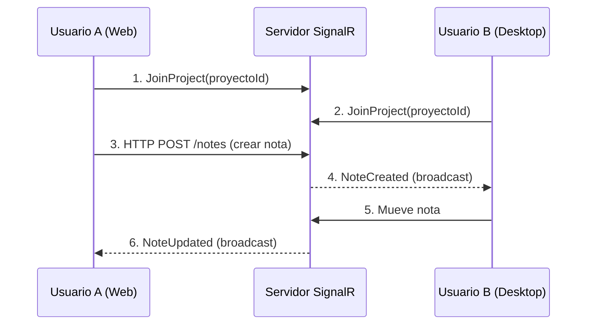

# Arquitectura de OpenStickyMemos

---

## 📐 Diagrama general



---

## 🏗️ Stack tecnológico

| Capa | Tecnología | Versión |
|------|-----------|---------|
| **Backend API** | ASP.NET Core | 10.0 |
| **ORM** | Entity Framework Core | 10.0 |
| **Base de datos** | PostgreSQL | 16 |
| **Tiempo real** | SignalR (WebSockets) | 10.0 |
| **Auth** | JWT Bearer + OAuth 2.0 (Google/Microsoft) | — |
| **Frontend Web** | Angular con Material | 19 |
| **Desktop** | WPF .NET + CommunityToolkit.Mvvm | 10.0 |
| **Containerización** | Docker (opcional) | — |
| **Hosting** | Railway (Nixpacks) | — |
| **CI/CD** | GitHub Actions | — |

---

## 🗄️ Modelo de datos



---

## 🔀 Flujo de autenticación



---

## ⚡ Flujo de tiempo real (SignalR)



---

## 📁 Estructura del proyecto

```
OpenStickyMemos/
├── src/
│   ├── OpenStickyMemos.slnx
│   ├── backend/
│   │   └── OpenStickyMemos.Api/
│   │       ├── Controllers/     ← Health, Auth, Projects, Notes
│   │       ├── Models/          ← User, Project, ProjectMember, Note
│   │       ├── Data/            ← AppDbContext + Migrations
│   │       ├── Services/        ← Jwt, Project, Note services
│   │       ├── Hubs/            ← NotesHub (SignalR)
│   │       └── DTOs/            ← Request/Response + Validators
│   ├── web/
│   │   └── open-sticky-memos/   ← Angular 19 SPA
│   │       ├── core/            ← Auth, SignalR, API, Interceptor
│   │       └── pages/           ← Login, Dashboard, Board
│   └── desktop/
│       └── OpenStickyMemos.Desktop/ ← WPF .NET 10
│           ├── Services/        ← API, Auth, SignalR, Settings
│           ├── ViewModels/      ← MVVM ViewModels
│           └── Views/           ← MainWindow, Login, Dashboard, Board
├── .github/workflows/           ← CI/CD pipelines
├── docs/                        ← Documentación
├── docker-compose.yml           ← (Opcional) Desarrollo local
└── README.md
```

---

## 🔐 Decisiones técnicas

| Decisión | Opción | Motivo |
|----------|--------|--------|
| **Tiempo real** | SignalR | Reconexión automática, grupos, integrado en .NET |
| **Resolución conflictos** | LWW (Last Writer Wins) | Simple, predecible |
| **Auth Desktop** | WebView2 + OAuth PKCE | Reutiliza flujo estándar, cada app maneja su propio login |
| **Persistencia tokens** | SQLite + DataProtection | Cifrado local, auto-login sin fricción |
| **Configuración** | appsettings.json + env vars | Portable, Railway-ready |
| **ORM** | EF Core + Migrations automáticas | Migraciones al iniciar, sin scripts manuales |
| **Frontend** | Standalone Components | Angular 19, sin NgModules, lazy loading |
| **Deploy Railway** | Nixpacks (sin Docker) | Build directo desde GitHub, más simple |
| **Distribución Desktop** | GitHub Releases (portable) | Sin store, descarga directa |
| **Code Signing** | SignPath.io | Gratuito para open-source |

---

## 📊 Endpoints de la API

| Método | Ruta | Auth | Descripción |
|--------|------|:----:|-------------|
| `GET` | `/api/health` | — | Health check |
| `POST` | `/api/auth/google` | — | Login con Google |
| `POST` | `/api/auth/microsoft` | — | Login con Microsoft |
| `POST` | `/api/auth/refresh` | — | Refresh JWT |
| `GET` | `/api/projects` | 🔐 | Listar proyectos |
| `POST` | `/api/projects` | 🔐 | Crear proyecto |
| `GET` | `/api/projects/{id}` | 🔐 | Detalle proyecto |
| `PUT` | `/api/projects/{id}` | 🔐 | Actualizar proyecto |
| `DELETE` | `/api/projects/{id}` | 🔐 | Eliminar proyecto |
| `POST` | `/api/projects/{id}/members` | 🔐 | Invitar miembro |
| `DELETE` | `/api/projects/{id}/members/{userId}` | 🔐 | Remover miembro |
| `GET` | `/api/projects/{id}/notes` | 🔐 | Notas del proyecto |
| `POST` | `/api/projects/{id}/notes` | 🔐 | Crear nota |
| `PUT` | `/api/projects/{id}/notes/{nid}` | 🔐 | Actualizar nota |
| `PATCH` | `/api/projects/{id}/notes/{nid}/position` | 🔐 | Mover nota |
| `DELETE` | `/api/projects/{id}/notes/{nid}` | 🔐 | Eliminar nota |
| `WS` | `/hubs/notes` | 🔐 | SignalR Hub |
