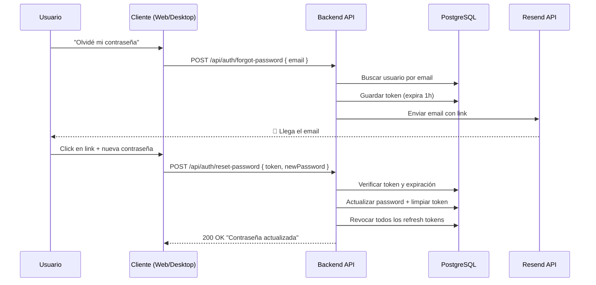

# Configuración de Email para OpenStickyMemos

## 📋 Resumen

OpenStickyMemos usa una arquitectura de **servicio de email intercambiable** mediante la interfaz `IEmailService`. Cada fork puede elegir el proveedor que prefiera sin modificar el código base.

## 📦 Proveedores incluidos

| Proveedor | Clase | Uso |
|-----------|-------|-----|
| **Log** (consola) | `LogEmailService` | Desarrollo local — imprime el link en la terminal |
| **Resend** | `ResendEmailService` | Producción — envía emails reales vía API REST |

## 🚀 Configuración rápida (Resend)

### 1. Crear cuenta en Resend

1. Ve a [resend.com](https://resend.com) y regístrate
2. Ve a **API Keys** y crea una nueva API Key
3. Copia la clave (empieza con `re_`)

### 2. Verificar un dominio (opcional para desarrollo)

En desarrollo puedes usar el dominio `onboarding@resend.dev` que viene preconfigurado.
Para producción, debes verificar un dominio propio en Resend.

### 3. Configurar en Railway

En Railway, agrega las siguientes **variables de entorno** en tu proyecto (backend):

| Variable | Valor | Obligatoria |
|----------|-------|-------------|
| `EMAIL_API_KEY` | `re_xxxxxxxxxxxx` | ✅ Sí |
| `EMAIL_FROM_EMAIL` | `tudominio@tudominio.com` | ❌ (default: `onboarding@resend.dev`) |
| `EMAIL_FROM_NAME` | `OpenStickyMemos` | ❌ |
| `WEB_BASE_URL` | `https://tu-frontend.railway.app` | ✅ Sí (para construir links de reset al frontend) |

> El link de reset apunta al **frontend Angular** (`WEB_BASE_URL/forgot-password?token=xxx`),
> no al backend. Por eso `WEB_BASE_URL` es obligatoria en producción.

### 4. Configurar en appsettings.json (desarrollo local)

```json
{
  "App": {
    "BaseUrl": "http://localhost:5000"
  },
  "Web": {
    "BaseUrl": "http://localhost:4200"
  },
  "Email": {
    "Provider": "Resend",
    "ApiKey": "re_xxxxxxxxxxxx",
    "FromEmail": "onboarding@resend.dev",
    "FromName": "OpenStickyMemos"
  }
}
```

> **Importante**: En producción **siempre** usa variables de entorno, no `appsettings.json`, para no exponer la API Key en el repositorio.

## 🔧 Cómo cambiar a otro proveedor

### Opción 1: Usar variable de entorno (sin código)

Si usas un servicio con API Key, solo cambia `EMAIL_API_KEY` en Railway y listo.

### Opción 2: Implementar otro servicio (con código)

1. Crea una nueva clase que implemente `IEmailService`:

```csharp
public class SendGridEmailService : IEmailService
{
    private readonly string _apiKey;

    public SendGridEmailService(IConfiguration configuration)
    {
        _apiKey = Environment.GetEnvironmentVariable("EMAIL_API_KEY")
                  ?? configuration["Email:ApiKey"]
                  ?? string.Empty;
    }

    public async Task SendPasswordResetEmailAsync(string to, string resetLink, string? displayName)
    {
        // Tu implementación con SendGrid, Mailgun, SMTP, etc.
    }
}
```

2. Regístrala en `Program.cs`:

```csharp
// Reemplaza esta línea:
builder.Services.AddHttpClient<IEmailService, ResendEmailService>();

// Por tu implementación:
builder.Services.AddSingleton<IEmailService, SendGridEmailService>();
// o
builder.Services.AddHttpClient<IEmailService, SendGridEmailService>();
```

### Opción 3: Usar SMTP genérico

Si prefieres SMTP, puedes usar `SmtpClient` del namespace `System.Net.Mail`:

```csharp
public class SmtpEmailService : IEmailService
{
    public async Task SendPasswordResetEmailAsync(string to, string resetLink, string? displayName)
    {
        using var client = new SmtpClient("smtp.gmail.com", 587)
        {
            Credentials = new NetworkCredential("user", "pass"),
            EnableSsl = true
        };
        
        var mail = new MailMessage("from@example.com", to)
        {
            Subject = "Restablece tu contraseña",
            Body = $"Haz clic aquí: {resetLink}",
            IsBodyHtml = true
        };
        
        await client.SendMailAsync(mail);
    }
}
```

## 📝 Endpoints de la API

| Método | Ruta | Descripción |
|--------|------|-------------|
| `POST` | `/api/auth/forgot-password` | Solicita reset. Body: `{ "email": "..." }` |
| `POST` | `/api/auth/reset-password` | Ejecuta reset. Body: `{ "token": "...", "newPassword": "..." }` |

### Flujo completo



## 🧪 Desarrollo local (sin email real)

Cuando no hay `EMAIL_API_KEY` configurada, el sistema usa `LogEmailService` automáticamente.
El link de reset aparece en la consola del backend:

```
=== PASSWORD RESET EMAIL (no delivery) ===
To: usuario@example.com
Name: Juan
Reset link: http://localhost:5000/reset-password?token=abc123...
===========================================
```

Además, la respuesta del endpoint `forgot-password` incluirá `debugResetLink` para facilitar las pruebas.

## 🌐 Frontend: Página de forgot-password

El frontend Angular tiene una página en `/forgot-password` que maneja dos estados:

1. **Sin token** (`/forgot-password`): Formulario para ingresar el email y solicitar el reset
2. **Con token** (`/forgot-password?token=XXX`): Formulario para ingresar la nueva contraseña

El Desktop WPF abre el navegador web en la URL del frontend al hacer clic en
"¿Olvidaste tu contraseña?". La URL del frontend se configura en:

- **Desktop appsettings.json**: `WebUrl: "http://localhost:4200"`
- **Variable de entorno**: `WEB_URL` (para Railway/despliegue)
- **Ventana de Configuración** del Desktop: campo "URL del frontend web"

## ⚙️ Variables de entorno completas

### Backend (Railway)

| Variable | Descripción |
|----------|-------------|
| `EMAIL_API_KEY` | API Key de Resend (o el proveedor que uses) |
| `EMAIL_FROM_EMAIL` | Email remitente |
| `EMAIL_FROM_NAME` | Nombre del remitente |
| `WEB_BASE_URL` | URL del frontend web (sin slash final) |

### Desktop (appsettings.json o variable de entorno)

| Variable | Descripción |
|----------|-------------|
| `WEB_URL` | URL del frontend web para abrir forgot-password |
| `API_URL` | URL del backend API |
| `SIGNALR_URL` | URL del hub SignalR |
